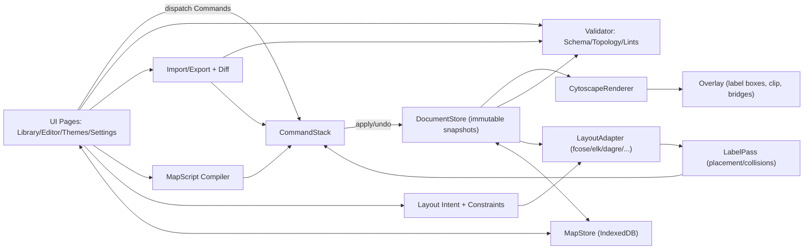

# ARCHITECTURE.md — System Design & Module Contracts

**Status:** Draft v1 (living)
**Owner:** Levi (Product / Tech Lead)
**Last updated:** 2025-11-04 (America/São_Paulo)
**Applies to:** Concept-map editor (GitHub Pages build; Electron-ready)
**Non-negotiables enforced here:** horizontal labels, topology profiles + repairs, full customization, robust import/patch with diff+undo, local persistence, command-based state.

---

## 1) Runtime overview

The app is a **static web bundle**. All compute is client-side. The UI (Editor/Library/Themes/Settings) talks to a **CommandStack** which mutates an immutable **DocumentStore**. Rendering uses **Cytoscape.js** plus a lightweight **Overlay** for label boxes, clip/fade under labels, and bridge glyphs. Layout is **Intent-driven** via a **LayoutAdapter** (fcose, elk/dagre, concentric/grid), followed by a **LabelPass**. Structural correctness is handled by **Validator** (schema + topology + lints) and **Repair** wizards. Persistence uses **IndexedDB**.



---

## 2) Core data model (high-level types)

> Full JSON is in `DATA-SCHEMA.md`. Here are TypeScript interfaces used across modules.

```ts
type ID = string; // opaque, stable (ULID/UUID-like)
type Slug = string; // optional human-friendly key

interface LabelStyle {
  orientation: "horizontal" | "follow-edge";
  wrapWidth?: number; padding?: number;
  fontFamily?: string; fontSize?: number; fontWeight?: number;
  haloWidth?: number; haloColor?: string;
  background?: { on: boolean; color?: string; opacity?: number; radius?: number };
  placement?: { policy: "midpoint"|"near-source"|"near-target"|"absolute"; t?: number; offsetX?: number; offsetY?: number; leader?: { on: boolean; length?: number } };
  edgeOverlapPolicy?: "none"|"clip"|"fade-under";
  visibilityPolicy?: "always"|"hover"|"zoom-threshold";
}

interface NodeDoc {
  id: ID; slug?: Slug; label: string;
  color?: string; shape?: "rect"|"roundrect"|"pill"|"ellipse"|"diamond"|"hex";
  size?: { mode: "auto"|"fixed"; w?: number; h?: number };
  position?: { x: number; y: number }; positionSource?: string; pinned?: boolean;
  groupIds?: ID[]; notes?: string;
}

interface EdgeDoc {
  id: ID; slug?: Slug; from: ID; to: ID; label?: string;
  color?: string; width?: number; dash?: "solid"|"dashed"|"dotted";
  arrow?: "none"|"triangle"|"vee";
  routing?: "curved"|"straight"|"orthogonal";
  labelStyle?: LabelStyle;
}

interface GroupDoc {
  id: ID; label: string;
  styleRef?: string; // name of a preset in Theme
  rule?: { kind: "label-regex"|"selector"; expr: string }; // optional rule-based membership
}

interface ConstraintSet {
  pins: Record<ID, { x: number; y: number }>;
  ranks: Array<{ type: "same-level"|"above"|"below"; a: ID; b: ID }>;
  edgeHints: Record<ID, "short"|"medium"|"long">;
}

interface LayoutIntent {
  structure: "force"|"hierarchy"|"concentric"|"grid"|"preset";
  spread: number;           // 0–100
  linkLength: number;       // 0–100
  avoidOverlap: boolean;
  levelSpacing: number;     // for hierarchy/concentric
  edgeRouting: "curved"|"straight"|"orthogonal";
  stability: number;        // 0–100 (stick to current positions)
  disconnected: "keep-close"|"separate";
}

interface TopologyProfile {
  name: "ConceptStrict"|"ConceptLax"|"CausalDAG"|"MindTree"|"General";
  rules: RuleSpec[]; // see §5
}

interface GraphDocument {
  version: number;
  meta: { title: string; created: string; modified: string; profile: TopologyProfile["name"] };
  nodes: Record<ID, NodeDoc>;
  edges: Record<ID, EdgeDoc>;
  groups: Record<ID, GroupDoc>;
  constraints: ConstraintSet;
  layoutIntent: LayoutIntent;
  themeId?: ID;
}
```

---

## 3) Modules & contracts

### 3.1 DocumentStore (immutable model & snapshotting)

**Role:** Owns the current `GraphDocument`. Produces immutable snapshots for undo/redo and autosave.

```ts
interface DocumentStore {
  get(): GraphDocument;                             // current immutable snapshot
  subscribe(fn: (doc: GraphDocument) => void): () => void;
  replace(doc: GraphDocument, reason: string): void; // used by CommandStack only
  // snapshots for versions/autosave handled by MapStore
}
```

**Invariants**

* Only the **CommandStack** mutates the store (`replace`).
* `version` increments on each successful command batch.

---

### 3.2 CommandStack (all mutations are commands)

**Role:** Applies atomic commands with inverse operations. Supports batch transactions and undo/redo.

```ts
type CommandName =
  | "AddNode" | "UpdateNode" | "RemoveNode"
  | "AddEdge" | "UpdateEdge" | "RemoveEdge"
  | "MoveNodes" | "PinNodes" | "UnpinNodes"
  | "AssignGroup" | "UpdateGroupStyle"
  | "ApplyLayout" | "ApplyConstraints"
  | "ImportReplace" | "ImportMerge"
  | "ApplyPatch" | "ApplyQuickFixes";

interface Command<T=any> {
  name: CommandName;
  payload: T;
  apply(doc: GraphDocument): GraphDocument;  // pure
  invert(prev: GraphDocument, next: GraphDocument): Command; // for undo
}

interface CommandStack {
  do(cmd: Command | Command[]): void; // batch = one transaction
  undo(): void; redo(): void;
  canUndo(): boolean; canRedo(): boolean;
  subscribe(fn: (stackState: { canUndo:boolean; canRedo:boolean }) => void): () => void;
}
```

**Notes**

* Batch operations (e.g., “Fix All”) are a single `do()` transaction.
* Imports and MapScript compile into command batches.

---

### 3.3 Validator (schema, topology, lints) & QuickFix engine

**Role:** Pure analysis; never mutates. Returns diagnostics and optional fix recipes.

```ts
type Severity = "error"|"warning"|"info";
interface Problem {
  id: string; rule: string; severity: Severity;
  message: string;
  targets: { nodes?: ID[]; edges?: ID[]; components?: ID[][]; cycle?: ID[] };// selection pointers
  fixIds?: string[]; // IDs of available quick-fix recipes
}

interface QuickFix {
  id: string; label: string;
  // returns a command or a command batch; never applies itself
  plan(doc: GraphDocument, problem: Problem): Command | Command[];
}

interface Validator {
  validate(doc: GraphDocument, profile: TopologyProfile): { problems: Problem[]; metrics: Metrics };
  listQuickFixes(problem: Problem): QuickFix[];
}
```

**Internals**

* **SchemaValidator** (JSON schema/type guards)
* **TopologyAnalyzer** (WCCs, SCCs/cycles, parallel edges, reciprocals, self-loops, orphans, bridges)
* **LintEngine** (label length, contrast, long edges, angular resolution)
* **FixPlanner** (merge parallel edges; connect components; break cycles; retarget/remove self-loops; connect/delete orphans)

---

### 3.4 LayoutAdapter (intent → engine params) & ConstraintSolver

**Role:** Convert human **LayoutIntent** + **ConstraintSet** + current graph into engine parameters; run engine; return positioned nodes. Then run **LabelPass**.

```ts
interface LayoutResult {
  positions: Record<ID, { x:number; y:number; source: string }>;
  // post-pass metrics useful for UI (overlap counts, longest edge length, etc.)
  stats: { nodeLabelOverlaps: number; edgeLabelOverlaps: number; longEdgeCount: number };
}

interface LayoutAdapter {
  run(doc: GraphDocument): Promise<LayoutResult>;
}
```

**Engines**

* **Force** → **fcose** (Cytoscape extension).
* **Hierarchy** → **elkjs** (preferred) or **dagre** fallback (web worker optional).
* **Concentric/Grid** → custom geometry (deterministic).
* **Preset** → use `position` persisted on nodes.

**ConstraintSolver**

* Pins: hard constraints (fixed x,y).
* Ranks: hard constraints for hierarchy (same-level, relative order).
* Edge hints: soft constraints weighting ideal edge lengths.

**Stability**

* Use current positions as seed; adapter maps **stability** slider to engine’s gravity/initial energy/iterations.

---

### 3.5 LabelPass (collision & placement, horizontal invariant)

**Role:** Post-layout geometry refinements. Always keeps text **horizontal** by default.

```ts
interface LabelPass {
  execute(doc: GraphDocument, positions: Record<ID,{x:number;y:number}>): {
    positions: Record<ID, {x:number;y:number}>;  // nudge nodes minimally
    edgeLabelPlacements: Record<ID, { t:number; offsetX:number; offsetY:number; leader?: number }>;
    stats: { nodeLabelOverlaps: number; edgeLabelOverlaps: number; longEdgeCount: number };
  };
}
```

**Algorithm (outline)**

1. **Node label nudge**: approximate each node label as an inflated rectangle; run 3–5 iterations of repulsive nudge with damping; **skip pinned**.
2. **Edge label placement** (per edge):

   * If `labelStyle.orientation === "horizontal"`:

     * Generate candidate positions (midpoint ± offsets; for orthogonal, prefer horizontal segments; if none long enough, place adjacent with **leader**).
     * Score = overlap penalty + distance from preferred + crossing penalty + leader penalty.
     * Pick min cost; write placement `{t, offsetX, offsetY, leader}`.
   * If `follow-edge`: place at arc normal with rotation (rare, user-opt-in).
3. **Long edge penalty**: if length >> median, apply small attraction between endpoints (unless pinned).

**Edge Under-Label handling**

* `edgeOverlapPolicy: "clip"` → handled by **Overlay** (mask a rectangle over edge beneath label box).
* `"fade-under"` → Overlay draws semi-transparent mask over the edge in the label box bounds.

---

### 3.6 Renderer (CytoscapeRenderer + Overlay)

**Role:** Map `GraphDocument` → visible scene.

* **CytoscapeRenderer**: nodes/edges + base styles (shapes, colors, arrowheads, dashes). Edge labels drawn by Cytoscape with `text-rotation: "none"` (horizontal) and **text background** + **halo** where supported.
* **Overlay** (HTML canvas/SVG layer atop Cytoscape):

  * Rich **label boxes** (precise wrap/padding/halo/background beyond core Cytoscape features).
  * **Clip/fade under label** implementations (mask over edge).
  * **Bridge glyphs** at crossings (optional).
  * Leader lines for displaced labels.

```ts
interface Renderer {
  mount(container: HTMLElement): void;
  update(doc: GraphDocument): void;             // full render refresh (diffed internally)
  applyPositions(pos: Record<ID,{x:number;y:number}>): void;
  applyEdgeLabelPlacements(pl: Record<ID, EdgeLabelPlacement>): void;
  setOverlayEnabled(b: boolean): void;
}
```

**Z-stack invariant**
`edges < edge labels < node shapes < node labels < overlay glyphs/menus`

---

### 3.7 Import/Export, Diff, Merge

**Role:** Convert between external JSON/ZIP and internal `GraphDocument`, compute diffs, apply merges as **commands**.

```ts
type ExportGranularity = {
  nodes: { ids?: boolean; labels?: boolean; positions?: boolean; styles?: boolean; groups?: boolean; notes?: boolean };
  edges: { ids?: boolean; endpoints?: boolean; labels?: boolean; routing?: boolean; styles?: boolean };
  groups: { defs?: boolean; membership?: boolean };
  theme?: boolean;
  layout?: { intent?: boolean; constraints?: boolean; pins?: boolean; };
};

interface ImportService {
  parse(json: string): ParsedDoc; // never mutates
  diff(current: GraphDocument, incoming: ParsedDoc): Diff; // by ID; semantic assist optional
  planApply(diff: Diff, policy: "Replace"|"ID-merge"|"Semantic-assist"): Command[]; // batch
}
```

**Semantic assist** (when IDs missing): try match by `slug`, else `(normalized label, degree signature)`; present candidates to user; create alias map on accept.

---

### 3.8 MapScript Compiler

**Role:** Parse DSL to **selectors** and **commands**; dry-run via Validator; Apply as batch.

```ts
interface MapScriptCompiler {
  parse(src: string): AST;
  compile(ast: AST, ctx: { doc: GraphDocument }): { commands: Command[]; diagnostics: Problem[]; diff: Diff };
}
```

* **Selectors:** `[id="n_..."]`, `[label~="regex"]`, `[from.label="A" && to.label="B"]`, group selectors, etc.
* **Directives:** `node`, `edge`, `update`, `delete`, `style`, `group`, `theme`, `profile`.
* **Errors:** precise line/column; no mutation on failure.

---

### 3.9 MapStore (IndexedDB) & SettingsStore

**Role:** Durable local persistence.

```ts
interface MapSummary { id: ID; title: string; updated: string; version: number; }
interface VersionEntry { at: string; doc: GraphDocument; note?: string; }

interface MapStore {
  list(): Promise<MapSummary[]>;
  get(id: ID): Promise<GraphDocument>;
  put(doc: GraphDocument): Promise<void>;
  delete(id: ID): Promise<void>;
  versions(id: ID): Promise<VersionEntry[]>;
  addVersion(id: ID, doc: GraphDocument): Promise<void>;
  exportAll(): Promise<Blob>;   // ZIP
  importAll(zip: Blob): Promise<void>;
}

interface SettingsStore {
  get(): Promise<any>; set(patch: any): Promise<void>;
}
```

**IndexedDB schema (object stores)**

* `maps`: key = `id`, value = latest `GraphDocument` (+ title, updated)
* `versions`: key = auto; index `mapId`; value = `{ mapId, at, doc }`
* `themes`: key = `id`, value = theme JSON
* `settings`: key = single `"settings"`, value = object

---

## 4) Key lifecycles (data flows)

### 4.1 User edit (canvas)

1. UI dispatches `AddNode` / `AddEdge` / `UpdateLabel` … as **Command**.
2. `CommandStack.do()` computes new `GraphDocument` (pure), pushes undo.
3. `DocumentStore.replace()` publishes snapshot.
4. `Renderer.update()` diffs + redraws; `MapStore.addVersion()` debounced autosave.

### 4.2 Layout run

1. UI triggers `ApplyLayout` (Command) with current `layoutIntent`.
2. `LayoutAdapter.run()` on current doc → node positions + label placements.
3. `LabelPass.execute()` refines placements and minor nudges.
4. `ApplyLayout.apply()` writes positions and edge label geometries to `GraphDocument`.
5. `Renderer.applyPositions()` / `applyEdgeLabelPlacements()` updates visuals.

### 4.3 Import JSON

1. UI opens file → `ImportService.parse()`; if parse error → Problems; return.
2. `ImportService.diff(current, incoming)` + selected **Merge policy**.
3. Show **Diff preview** + **Topology** Problems.
4. On **Apply**, `CommandStack.do([ImportMerge ...])` as one batch.

### 4.4 MapScript patch

1. Monaco editor → `Compiler.parse()` → AST.
2. `compile()` → commands + diagnostics + diff.
3. Show Problems (blocking errors). **Apply** → `CommandStack.do(commands)`.

### 4.5 Topology “Fix All”

1. `Validator.validate()` → Problems.
2. For each group of Problems, `FixPlanner.plan()` builds a **single batch**.
3. `CommandStack.do(batch)`; `DocumentStore` publish → Renderer refresh.

---

## 5) Topology Profiles & Metrics (rules as data)

```ts
interface RuleSpec {
  id: string; severity: "error"|"warning";
  kind: "directed"|"simple-digraph"|"no-self-loops"|"single-wcc"|"acyclic"|"no-orphans"|"max-parallel-edges"|"reciprocal-edges-info";
  params?: any;
}
```

**Built-ins**

* `ConceptStrict`: directed + simple-digraph + no-self-loops + single-wcc (errors); cycles warn; orphans warn.
* `ConceptLax`: directed + simple-digraph (errors); single-wcc warn; cycles warn.
* `CausalDAG`: directed + simple-digraph + acyclic (errors); single-wcc warn.
* `MindTree`: undirected + tree (connected + acyclic) (errors).
* `General`: all informational.

**Metrics** returned alongside Problems: `{ wccCount, sccCount, parallelPairs, selfLoops, orphans, crossings, avgDegree, edgeLen: {median, p95}, angularMin }`.

---

## 6) Performance & threading

* **Target:** 100 nodes / 150–200 edges → layout+label pass < 300 ms; interactions < 50 ms.
* **Threading:** Default in main thread; **optional Web Worker** boundary for **elk/dagre** and **heavy validation** (SCCs, bridges) if profiling shows > 16 ms stalls.
* **Diff rendering:** Cytoscape incremental updates; Overlay redraws dirty regions only.
* **GC pressure:** Avoid large transient arrays; reuse typed arrays for geometry.

---

## 7) Errors, logging, feature flags

* **Errors:** All module APIs are **exception-free** to callers; return Results/Problems; UI surfaces in Problems/Toasts. Imports/patches never apply on parse/validation errors.
* **Logging:** Minimal console logs in dev; no telemetry. Provide a debug panel toggle to see metrics and layout timings.
* **Feature flags:** `bridgeGlyphs`, `orthogonalRouterAdvanced`, `overlayClipMask` (enable/disable from Settings for performance).

---

## 8) Extensibility points

* **Engines:** new adapters implementing `LayoutAdapter` (e.g., “layered-radial”).
* **Profiles:** add JSON rule sets; Validator auto-consumes.
* **MapScript:** extend grammar with new directives; selectors remain stable.
* **Themes:** add token families (e.g., print presets).
* **Renderer overlay:** plug-in glyph painters (e.g., custom anchors, callouts).

---

## 9) Security & privacy

* No network calls post-load; all data local.
* SRI on CDN scripts; local fallback bundles available.
* Export only on explicit user action; ZIPs contain plain JSON.

---

## 10) Build & packaging

* **Language:** TypeScript.
* **Bundler:** Vite/esbuild; outputs `/dist` static assets.
* **Libraries:** Cytoscape.js (+ fcose), elkjs (or dagre), Monaco (optional), idb (IndexedDB helper), a11y color tools.
* **Deploy:** GitHub Pages (branch `/docs` or `/gh-pages`).
* **Electron (later):** Same modules; replace MapStore with FS adapters; enable Node integration for dialogs; optional local LLM process.

---

## 11) Module boundary checklist (what each **must not** do)

* **UI** must not mutate `DocumentStore` directly (commands only).
* **Validator** must not mutate anything (pure).
* **LayoutAdapter** must not call `DocumentStore.replace` (returns positions; `ApplyLayout` writes).
* **Renderer** must not own state beyond view models; it reflects `DocumentStore`.
* **Import/Compiler** must not apply changes; they **plan** command batches only.

---

## 12) ADR seeds (decisions locked)

* **ADR-001:** Identity via opaque IDs, not labels/topology.
* **ADR-002:** Edge/node labels horizontal by default; overlay provides clip/fade and leaders.
* **ADR-003:** Intent-driven layout (fcose/elk/dagre) + post LabelPass instead of engine-specific UI.
* **ADR-004:** All mutations via CommandStack; imports/repairs are single transactions.
* **ADR-005:** Profiles as data; Validator + FixPlanner control conformance.
* **ADR-006:** IndexedDB with simple versions; autosave debounced.

---

## 13) Minimal public API surface (what tests & pages can import)

```ts
export const documentStore: DocumentStore;
export const commandStack: CommandStack;
export const validator: Validator;
export const layoutAdapter: LayoutAdapter;
export const labelPass: LabelPass;
export const renderer: Renderer;
export const mapStore: MapStore;
export const settingsStore: SettingsStore;
export const importService: ImportService;
export const mapScriptCompiler: MapScriptCompiler;
```

These are the only singletons pages import. Everything else is internal.

---

**This architecture is binding.** If an implementation shortcut would violate: horizontal labels, command-only mutations, validation safety, profile enforcement/repairs, or persistent local storage with autosave—**stop and write an ADR to change the architecture**.
